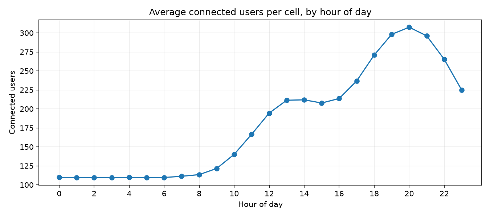
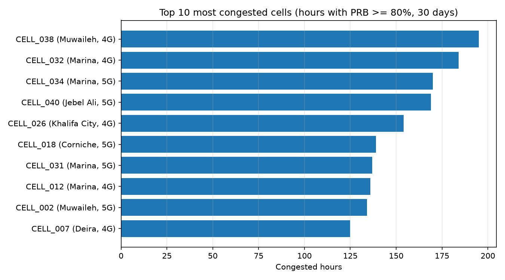

# Telecom Network KPI Analysis

Python and SQL analysis of a **simulated** 4G/5G mobile network: traffic patterns,
cell congestion and outage detection.

> **Note:** all data is synthetic, generated by `src/generate_data.py`. It does not come
> from any real operator. Patterns such as the daily traffic curve were designed into the
> simulation, so this project demonstrates analysis methods, not real-world findings.

## Overview

The dataset simulates 30 days (September 2026) of hourly KPIs for 40 cells in Dubai,
Abu Dhabi and Sharjah, mixing 4G and 5G sites (28,800 records). I analyze it twice,
with pandas and with SQL, and cross-check that both give the same results.

## Key findings

- **Data quality:** 28,800 records, no missing values, no duplicates.
- **Traffic pattern:** load peaks around 20:00 (about 308 users per cell), roughly three
  times the overnight level, with a smaller peak around 13:00.
- **4G vs 5G:** 5G averages about 164 Mbps and 17 ms latency, versus about 31 Mbps and
  51 ms for 4G.
- **Congestion:** the most congested cell (CELL_038, Muwaileh, 4G) exceeded 80% PRB
  utilization for 195 hours, about 27% of the period.
- **Outages:** 12 outage events detected (2 to 6 hours each, 44 cell-hours in total).





## Project structure

```
├── data/          Generated CSV files (the SQLite database is built locally)
├── images/        Charts used in this README
├── notebooks/
│   ├── 01_exploration.ipynb   pandas analysis
│   └── 02_sql_analysis.ipynb  SQL analysis
├── src/
│   ├── generate_data.py       Synthetic data generator
│   └── build_database.py      Loads the CSVs into SQLite
└── requirements.txt
```

## Tools

Python, pandas, NumPy, Matplotlib, SQL (SQLite), Jupyter, Git.

## How to reproduce

```powershell
git clone https://github.com/David-velez-uae/telecom-network-kpi-analysis.git
cd telecom-network-kpi-analysis
python -m venv .venv
.venv\Scripts\Activate.ps1
pip install -r requirements.txt
python src\generate_data.py
python src\build_database.py
```

Then open the notebooks in `notebooks/` with Jupyter or VS Code.
The generator uses a fixed random seed, so the results are reproducible.

## Limitations

- Synthetic data: differences between areas (for example Marina appearing several times
  among the most congested cells) come from random load assignment and are not meaningful.
- The simulator uses the same drop-rate formula for 4G and 5G, so that KPI does not
  differentiate the technologies.

## Possible next steps

- Prioritize capacity upgrades or 4G-to-5G offloading for the most congested 4G cells.
- Investigate cells with repeated outages, such as CELL_001.
- Repeat the analysis with public telecom datasets.

## Author

**Julian David Velez** | Telecommunications Engineering student, Junior Data Analyst
[LinkedIn](https://www.linkedin.com/in/julian-david-velez-754605425)